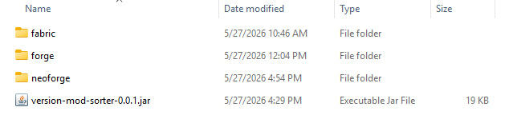
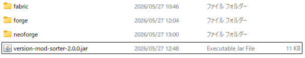

[日本語版はこちら / Japanese](#japanese)

[](../../releases)
[](LICENSE)


# Version Mod Sorter

A Minecraft mod that loads mods from version-specific folders. Supports Fabric, Forge, and NeoForge.

Place mods in `mods/<loader>/<version>/` folders (e.g. `mods/fabric/1.20.4/`), and only the mods matching the current loader and Minecraft version will be loaded. This lets you keep mods organized even when switching between multiple versions and loaders.

## Requirements

- Fabric Loader 0.12.0+ / Forge 41.1.0 (Minecraft 1.19)+ / NeoForge 20.5 (Minecraft 1.20.5)+
- A single jar works across all supported loaders and Minecraft versions — no need for separate builds.

## Installation

Download the latest `version-mod-sorter-x.x.x.jar` from [Releases](../../releases) and place it in your `mods` folder. The same jar works with Fabric, Forge, and NeoForge.

## Usage

1. Launch the game once. A folder `mods/<loader>/<version>/` (e.g. `mods/fabric/1.20.4/`) will be created automatically. Loader names are `fabric`, `forge`, and `neoforge`.
2. Place the `.jar` files you want to use for that version into the folder.
3. Launch the game again. The mods in the folder will be loaded.

The folder structure looks like this:

```
📁 mods
├─ version-mod-sorter-x.x.x.jar
│  (VMS itself)
├─ ModA.jar
│  (mods/ root: loaded on every loader and version)
├─ 📁 fabric
│  ├─ ModB.jar
│  │  (Fabric: loaded on every version)
│  └─ 📁 26.1.2
│     ├─ ModC.jar
│     │  (Fabric MC26.1.2 only)
│     └─ 📁 folder
│        └─ ModD.jar
│           (subfolders can be used for organization)
├─ 📁 forge
│  ├─ ModE.jar
│  │  (Forge: loaded on every version)
│  └─ 📁 1.21.4
│     └─ ModF.jar
│        (Forge MC1.21.4 only)
└─ 📁 neoforge
   ├─ ModG.jar
   │  (NeoForge: loaded on every version)
   └─ 📁 1.20.6
      └─ ModH.jar
         (NeoForge MC1.20.6 only)
```



Nothing happens while the folders are empty — the game starts normally.

## Usage Examples

- When switching between versions or loaders (e.g. for multiplayer), mods are managed per-loader and per-version in separate folders — no need to swap mod files.
- Subdirectories are also supported. You can organize mods by category within a version folder.

```
mods/fabric/1.20.4/
├─ performance/
│  ├─ sodium.jar
│  └─ lithium.jar
└─ utility/
   └─ minimap.jar
```

## How It Works

At launch, the mod detects the current loader and Minecraft version, then loads mods from `mods/<loader>/<version>/`. It uses each loader's official mechanism (Fabric's `fabric.addMods`, Forge/NeoForge's mod discovery API) and does not modify any Minecraft classes or bytecode. This is why a single jar works across all loaders and versions.

## Tested Environments

- Windows 11 — Fabric Loader 0.19.2 / Forge 44.1.23 (MC 1.19.3) / Forge 54.1.16 (MC 1.21.4) / Forge 62.0.9 (MC 26.1) / Forge 64.0.8 (MC 26.1.2) / NeoForge 21.4.157 / NeoForge 26.1.2.66-beta
- macOS (Apple M2) — Fabric Loader 0.19.2 (MC 1.20.4)

## Notes

- The version folder name must exactly match the Minecraft version reported by the loader.
- Mods in `mods/<loader>/<version>/` are loaded in addition to mods in the regular `mods/` folder.
- On Fabric, if there are mods to load, the process is relaunched once at startup. Forge and NeoForge do not require a relaunch.
- This mod relies on internal loader implementations, so a major loader update may cause it to stop working. In that case, only this mod is affected — it does not modify Minecraft or the loader itself, so the game and other mods will be fine.

## Support

Please report bugs and ask questions via [Issues](../../issues).

---

<a id="japanese"></a>

# Version Mod Sorter（日本語）

Minecraftのバージョンごとに、対応するMODだけを読み込ませるMOD。Fabric・Forge・NeoForgeに対応しています。

`mods/` の中にローダーとバージョンのフォルダ（例: `mods/fabric/1.20.4/`）を作り、そこにMODを入れておくと、起動中のローダーとバージョンに一致するフォルダのMODだけが読み込まれます。複数のバージョンやローダーを使い分けていても、MODを整理しておけます。

## 動作環境

- Fabric Loader 0.12.0 以降 / Forge 41.1.0（Minecraft 1.19）以降 / NeoForge 20.5（Minecraft 1.20.5）以降
- 対応ローダーが動作するMinecraftのバージョンであれば、MCのバージョンごとに別のjarを用意する必要はありません。1つのjarで動作します。

## 導入

[Releases](../../releases)から最新の `version-mod-sorter-x.x.x.jar` をダウンロードし、`mods` フォルダに入れます。同じjarをFabric・Forge・NeoForgeのいずれでもそのまま使えます。

## 使い方

1. 一度ゲームを起動すると、`mods/<ローダー>/<バージョン>/`（例: `mods/fabric/1.20.4/`）が自動で作成されます。ローダー名は `fabric`・`forge`・`neoforge` です。
2. そのフォルダに、そのバージョンで使いたいMODの `.jar` を入れます。
3. もう一度起動すると、フォルダ内のMODが読み込まれます。

フォルダ構成は次のようになります。

```
📁 mods
├─ version-mod-sorter-x.x.x.jar
│  (VMS本体)
├─ ModA.jar
│  (mods/ 直下: 全ローダー・全バージョンで読み込み)
├─ 📁 fabric
│  ├─ ModB.jar
│  │  (Fabric: 全バージョンで読み込み)
│  └─ 📁 26.1.2
│     ├─ ModC.jar
│     │  (Fabric MC26.1.2 専用)
│     └─ 📁 folder
│        └─ ModD.jar
│           (サブフォルダで整理可能)
├─ 📁 forge
│  ├─ ModE.jar
│  │  (Forge: 全バージョンで読み込み)
│  └─ 📁 1.21.4
│     └─ ModF.jar
│        (Forge MC1.21.4 専用)
└─ 📁 neoforge
   ├─ ModG.jar
   │  (NeoForge: 全バージョンで読み込み)
   └─ 📁 1.20.6
      └─ ModH.jar
         (NeoForge MC1.20.6 専用)
```



フォルダが空の間は何も起きず、通常どおり起動します。

## 使用例

- マルチプレイなどでバージョンやローダーを切り替えても、MODの入れ替えは不要です。ローダーごと・バージョンごとにフォルダで管理できます。
- サブディレクトリにも対応しています。MODを種類ごとにフォルダ分けして整理できます。

```
mods/fabric/1.20.4/
├─ performance/
│  ├─ sodium.jar
│  └─ lithium.jar
└─ utility/
   └─ minimap.jar
```

## 仕組み

起動時に実行中のローダーとMinecraftバージョンを判定し、`mods/<ローダー>/<バージョン>/` のMODを読み込みます。読み込みには各ローダー公式の仕組み（Fabricの `fabric.addMods`、Forge・NeoForgeのMOD探索API）を使い、Minecraftのクラスやバイトコードの書き換えには一切触れていません。そのため1つのjarがどのローダー・バージョンでも動作します。

## テスト済み環境

- Windows 11 — Fabric Loader 0.19.2 / Forge 44.1.23（MC 1.19.3）/ Forge 54.1.16（MC 1.21.4）/ Forge 62.0.9（MC 26.1）/ Forge 64.0.8（MC 26.1.2）/ NeoForge 21.4.157 / NeoForge 26.1.2.66-beta
- macOS（Apple M2） — Fabric Loader 0.19.2（MC 1.20.4）

## 注意点

- フォルダ名のバージョンは、ローダーが報告するMinecraftのバージョン名と一致させる必要があります。
- `mods/<ローダー>/<バージョン>/` のMODは、通常の `mods/` 直下のMODに加えて読み込まれます。
- Fabricでは、読み込むMODがある場合に起動時のプロセスを一度だけ起動し直すため、起動が二段階になります。Forge・NeoForgeでは起動し直しは行いません。
- 各ローダーの内部実装を利用しているため、ローダーの大型アップデートで読み込みが機能しなくなる場合があります。その場合もMinecraft本体やローダーの書き換えは行っていないため、本MODが働かなくなるだけで、ゲーム自体やほかのMODへの影響はありません。

## 問い合わせ

不具合の報告や質問は [Issues](../../issues) からお願いします。
